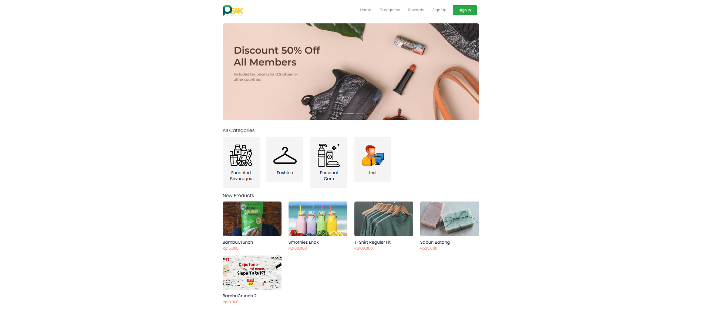
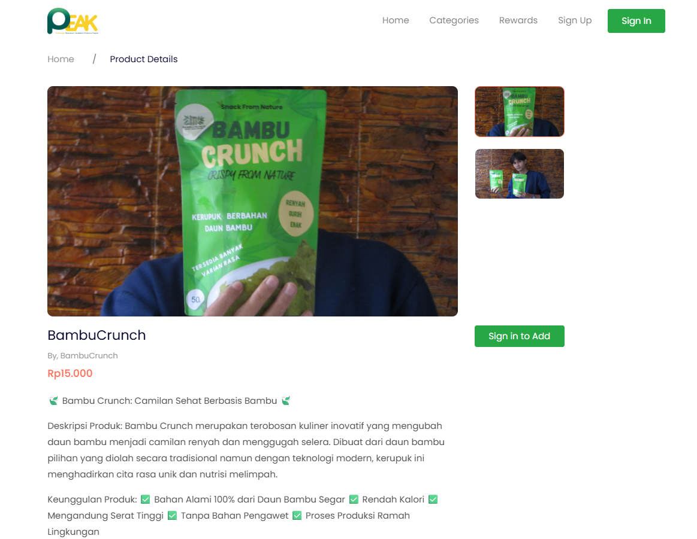
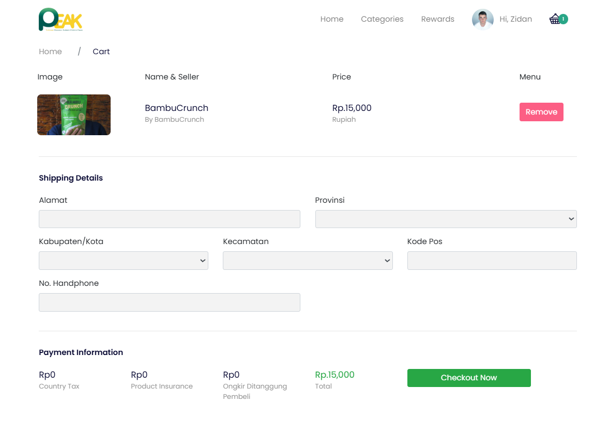

# Peak Commerce

E-commerce platform developed for the Wirausaha Merdeka program to centralize product listings from multiple group members. Features vendor management, product catalogs, and integrated checkout system.

## Screenshots

### Home Page

### Product Detail

### Checkout

## Features

- **Vendor Management**: Centralized system for managing multiple group members and their listings.
- **Product Catalogs**: Comprehensive catalog system to showcase products effectively.
- **Integrated Checkout System**: Seamless purchasing experience for customers.

## Technology Stack

- **Framework**: Laravel
- **Language**: PHP, JavaScript
- **Styling**: CSS / TailwindCSS (if applicable)

---

Developed for Wirausaha Merdeka.
